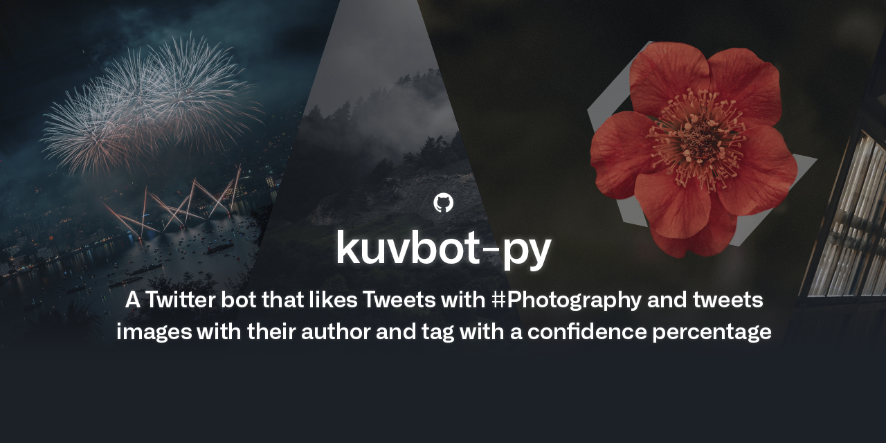

#  kuvbot-py

Kuv is a Twitter bot written in Python 3.10.5 that scrapes images from across the web, edits them, credits them to their author, tags them with a word and a corresponding confidence percentage using A.I. techniques, and finally tweets them.

It is currently using the [Unsplash](https://github.com/unsplash) API as an image source, the [Imagga](https://github.com/imagga) API for image recognition and the [Twitter](https://github.com/twitter) API for programmatic access to Twitter in advanced ways.

Image scraping is guaranteed by the [Requests](https://github.com/psf/requests) HTTP library. To edit them, the used module is [Pillow](https://github.com/python-pillow/Pillow), the Python Imaging Library fork. To easily access the Twitter API from Python, [Tweepy](https://github.com/tweepy/tweepy) has been used.

In order to keep consistency in this project, [black](https://github.com/psf/black) has been used as a code formatter for Python files.

If you'd like to contribute, feel free to open a pull request and if proven helpful, I will credit you! 😄
